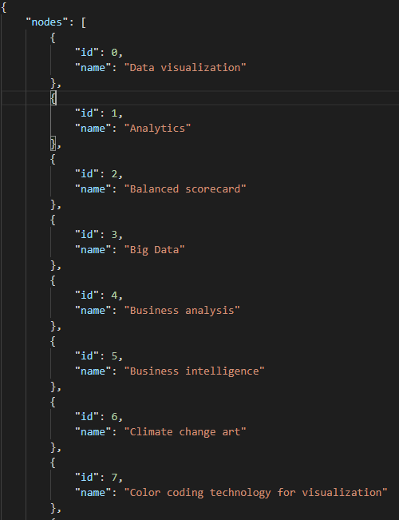
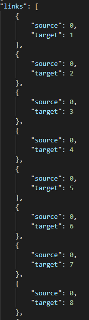

# Wiki API Scrape

## To Use

* `git clone git@github.com:whagan/wiki.git`
* `cd wiki`
* `virtualenv venv && source venv/bin/activate` (optional python virtual environment)
* `pip install -r requirements.txt`
* `python graph.py`

## What is It?

This program uses Wikipedia's API to collect *See also* links for individual Wikipedia pages. These pages and links represent a directed graph. For instance, a user may reach *Predictive Analytics* from *Data visualization* using only Wikipedia's *See also* links:

*Data visualization* -> *Data analysis* -> *Predictive analysis* 

The program is a long-running script. If an endpoint is specified, the program terminates when it is found. Otherwise the program may continue searching without end. The program creates and records to *graph.log* as it executes:

The graph it produces is stored in *wiki_nodes_links.json* and looks like this:

A pickle file is also created. *sql_graph.py* unpickles *graph.pickle* and converts the data into *graph.json*, which is a json of nodes and links: 

*sql_graph.py* also has an *upload()* function, which is a work in progress. When it is complete, it will load the graph into a sqlite database (sqlite required).

Let's get biblical: Does a path exist between *Book of Genesis* and *Book of Revelation*? 
